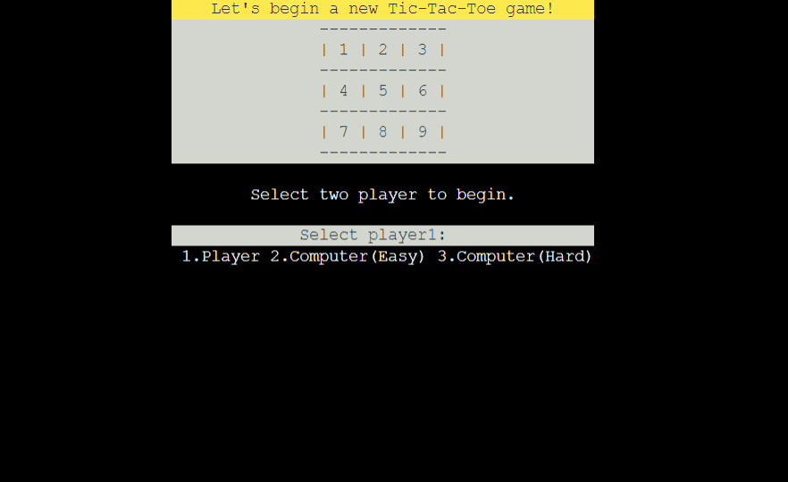
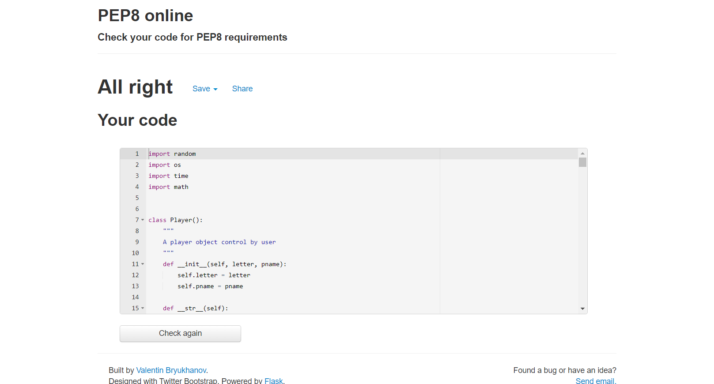
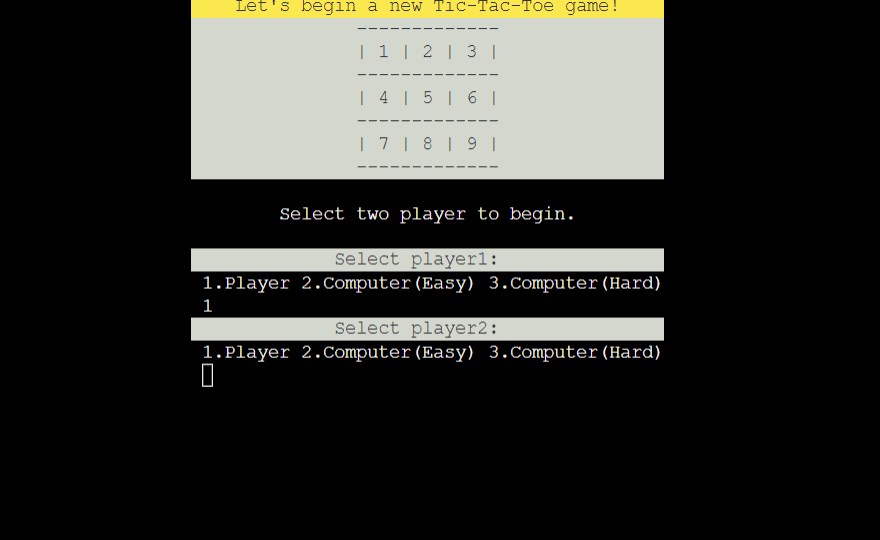
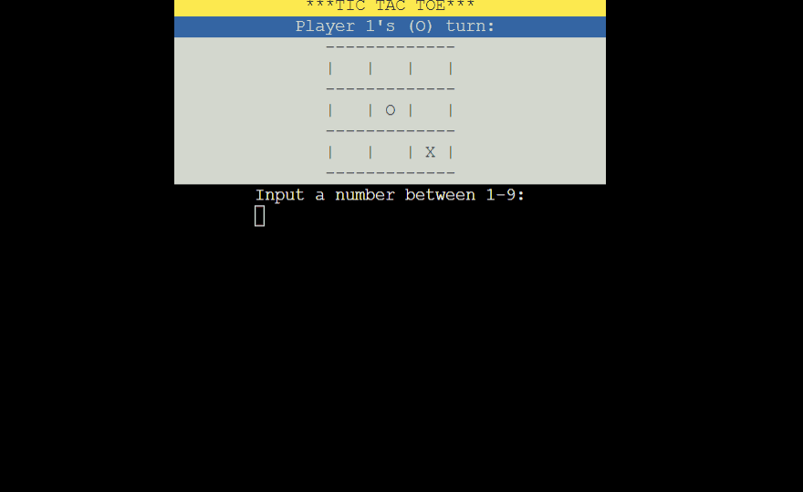
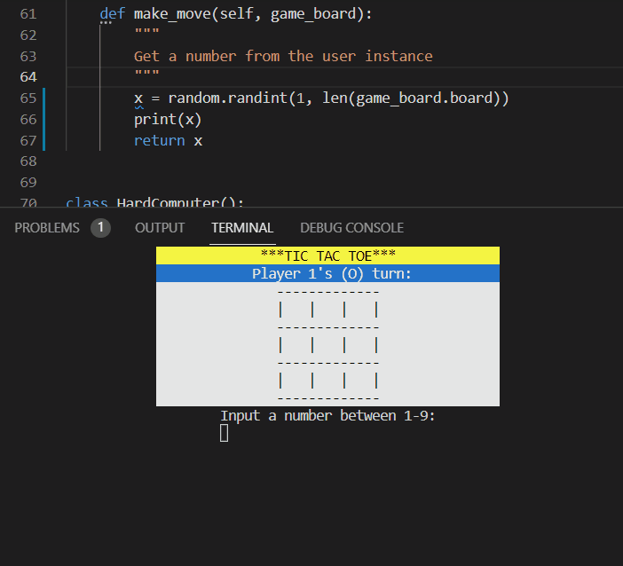
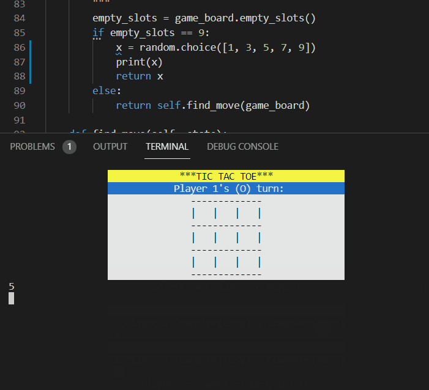
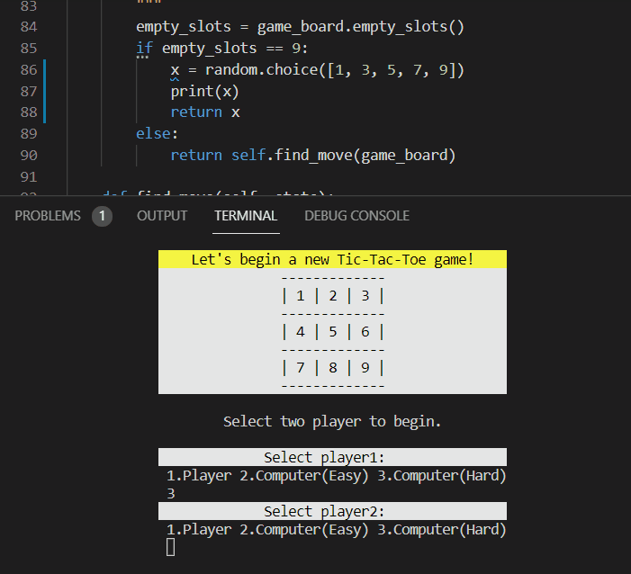

# Try to win: a tic tac toe match
# Milestone Project 3

## Introduction
Tic Tac Toe is a classic paper and pencil game for two players. \
The player who succeeds in placing three of their marks in a horizontal, \
vertical, or diagonal row will be the winner.
For more infomation you can read the article in [Wikipedia](https://en.wikipedia.org/wiki/Tic-tac-toe) \
And this time, user can play the tic tac toe game in the Code Institute mock terminal.

Living website: https://ci-portfolio-project-3.herokuapp.com/ \
Github repository: https://github.com/cloki0610/CI-Portfolio-Project-3
## How to play
First of all, the user should select two player before begin a new game. \
There are three types of player option: Player, Computer(Easy), and computer(Hard) \
Once the players selected, a new tic tac toe game will begin. \
If the player is not control by computer, they can use number 1 - 9 to select the empty slot. \
If one of the player win the game, or the game board are filled, \
the game will come to an end and display the message to let player decied to begin a new game, \
or leave the game and shut down the programme.

## Feature
### Existing Feature
* A functional tic tac toe game board
* A random picked computer player
* A computer player act with a minimax algorithm
* User can decide to play with a player or computer with two different diffculty.
* The game board can check who is the winner in each step.
* The game board can accept the player's input
* The game board can validate the input, if input is invalid, there will display warning message.

### Future Feature
* User will be allowed to enter and display his customer player name.
* More new games will come (not so soon).

## Data Model
There are four class models in the programme, three class model are use to create three type of player instance, and the fourth class model use to create the game board the user will use in game.

### Players (User or computer)
Player classes are almost the same, they have two value to store the player name and the letter they will use. They all use a \__str__ magic method print their player type. And a make_move function to send a number to the board instance.
* Player class use the make_move method to get a number from user. \
If the number is invalid, a warning message will appear, \
if the grid user selected is not empty, another warning message will appear.
* EasyComputer class use make_move method to out put a number between 1-9 without validation.
* HardComputer class use make_move the call the find_move method to calculate the best move, \
but if current game board is empty, this method will return a random number of 1,3,5,7 or 9.
* The find_move method will loop over all the avaliable move, and use algorithm to find move with the highest score, and store as the best move, and return the best move as number in the end.

### Game board
GameBoard class have 4 values, board, winner, player1 and player2.
* board is an 9 elements array to represent the game board.
* winner is a value to store the winner when one of the player win a game.
* player1 and player2 is two value use to store two instance who will be a part of the match.

And the game board can use 10 methods for the gaming process.
* The main game function seperate to two method, player_select to decide the player type, \
and new_game to make a new game begin.
* The player_select method will call the print_instruction method to print out a board with number 1-9 and the welcome message, then the method will accept two number use to let the programme create player instances by add_new_player method, and call the new_game method to begin new game.
* The main game function seperate to two method, player_select to decide the player type, \
and new_game to make a new game begin.
* Once the inputs are valid the instances will be create and a new game will begin by new_game.
* Each step the clear_terminal method will be called to clear previous output
* Then print_board will be call for print out the current status of the game board
* Then get_move will get two number from player1 and player2 instance to get number for their move
* After each move, the check_winner will be called to check is there have a winner or not
* If the board have been filled or one of the player meet the requirement to be the winner,
the result method will be called to show the result of current.
* The result method will accept y or n as input to restart a new game, or shut down the programme

## Deployment
The project create by Code Institude's mock terminal for Heroku. \
Steps to deploy:
 * Create a new Heroku application
 * Set the project name as ci-portfolio-project-3
 * Set deployment method to Github
 * In Config Vars inside the setting section, set KEY to 'PORT' and VALUE to '8000' and press ADD to create a new config var.
 * Add the Python and Node.js as buildpack in setting section
 * Back to deploy section and press 'Deploy' in Manual deploy

## Testing
### Validator testing
No errors were returned from pep8online.com

### Functional testing
* Player class
    1. __ str __ method  
    In player_select method, the print() function on line 421 and 422 will print text by _str_ magic method. \
    I use these code for testing and the text is correctly print as expected. 
    
    2. make_move method  
    This method will return a number from user input, so I can test this method directly on the living website, if the input is invalid, a red warning message "Invalid input, please try again!!!" will print out as following image.
    
* EasyComputer class
    1. _str_ method
    In player_select method, the print() function on line 421 and 422 will print text by _str_ magic method. \
    I use these code for testing and the text is correctly print as expected. 
    2. make_move method  
    This method will return a number in range 1-9 to the game board instance.  
    To test the method I modify the code to print out the result as following image.
    
* HardComputer class
    1. _str_ method
    In player_select method, the print() function on line 421 and 422 will print text by _str_ magic method. \
    I use these code for testing and the text is correctly print as expected. 
    2. make_move method  
    This method have two thing to test.  
    First if the game board is blank, the method will return a random number from 1,3,5,7 or 9.
    
    If the board is not blank, the method will get a number from find_move method.
    3. find_move and find_best_score 
    It is hard to test these two methods because the find_best_score will return a set of data because it using recursion to calculate the result.
    
    All I can do is try to test the method in the game to make sure the computer have try to make the best move in each step.
* Board class
    1. 
    2. 
    3. 
    4. 
    5. 
    6. 
    7. 
    8. 
    9. 
    10. 

### Bug fixed
* Try again message error
After the result method called, enter n in the first time the program do not end and repeat the input message. I found there is some problem in the loop and fix the problem.
* validation message error
The validatpon message of validate user input show the result not as expected. \
I found that is because the avaliable_move array is wrong because it should be number in 1-9.
* Misplaced
The game board misplace into unexpected place and display an errror result. \
In the and I decide to use another way to style the game board and contents.

### Bug unfixed
* If player enter the input in a too short time, the programme will accept the input without display.

## Credit
### Code
* [12 Beginner Python Projects (develop by Kylie Ying)](https://youtu.be/8ext9G7xspg) \
This video help a lot when I try to make up my idea. \
I also use some code in these project to find out the avaliable move on the board, \
and create the easy computer class. \
This video also have a sample that let me know how to remake my own version tic tac toe game.

* [Mastering Tic-Tac-Toe with Minimax Algorithm in Python](https://levelup.gitconnected.com/mastering-tic-tac-toe-with-minimax-algorithm-3394d65fa88f) \
This is where I have my understanding about the minimax algorithm. \
And try to solve the problem in my way.

* [Clear terminal in Python](https://stackoverflow.com/questions/2084508/clear-terminal-in-python) \
I used the tricks in this article to know how to clear the terminal display.

* [How to print colored text to the terminal](https://stackoverflow.com/questions/287871/how-to-print-colored-text-to-the-terminal) \
Through this article I find the way to color the text.

### Tools
* Git
* Gitpod
* Github
* Heroku
* PEP8online.com

### Acknowledgment
Thank you my mentor Daisy McGirr for all support and guidance in the process.